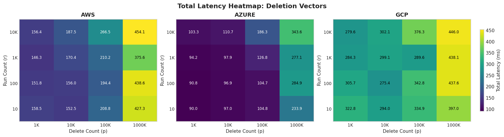

<!--
  - Licensed to the Apache Software Foundation (ASF) under one
  - or more contributor license agreements.  See the NOTICE file
  - distributed with this work for additional information
  - regarding copyright ownership.  The ASF licenses this file
  - to you under the Apache License, Version 2.0 (the
  - "License"); you may not use this file except in compliance
  - with the License.  You may obtain a copy of the License at
  -
  -   http://www.apache.org/licenses/LICENSE-2.0
  -
  - Unless required by applicable law or agreed to in writing,
  - software distributed under the License is distributed on an
  - "AS IS" BASIS, WITHOUT WARRANTIES OR CONDITIONS OF ANY
  - KIND, either express or implied.  See the License for the
  - specific language governing permissions and limitations
  - under the License.
  -->

# Compaction Maps for Apache Iceberg

This branch of Apache Iceberg adds **compaction maps**: a compact data structure that records the position transformations applied by a compaction so that concurrent transactions writing position deletes (or deletion vectors) can be rebased onto the new layout instead of restarted.

Compactions and concurrent updates logically commute — compaction does not change table contents — but in current table formats they conflict on direct file references. A compaction map captures, per run of rows, the move from a source file to one or more target files. Either side of a conflict can use the map to rewrite its position-delete references and commit, with no global coordination beyond Iceberg's existing snapshot pointer swap.

## Paper

Chris Douglas and Joseph M. Hellerstein. **Commutative Compaction.** *1st International Workshop on Data FORMATS for Modern Architectures and Workloads ([FORMATS '26](https://dataformats.org/))*, May 31–June 5, 2026, Bengaluru, India. ACM. <https://doi.org/10.1145/3802514.3809174>

The paper introduces compaction maps, the rebase operation, and the remapping policy, and evaluates an Apache Iceberg prototype (this branch) on Apache Spark 3.5 and 4.0 with both v2 position delete files and v3 deletion vectors.

## Benchmark Results

End-to-end remapping was measured against object storage in three clouds (AWS S3 us-west-2, Azure ADLSv2 westus2, GCS uswest1) on commodity VMs (4 vCPU, 16 GiB), varying the number of runs in the compaction map (10 to 10K) and the size of the position delete file or deletion vector (1K to 1M deletes):




- Repairing a 1M-delete commit against a 10K-run compaction map completes in **under one second in every cloud**, including all I/O — 0.34–0.45 s for deletion vectors and 1.8–2.3 s for position delete files.
- At 10K deletes (typical commit size) latency never exceeds **half a second** in any cloud, regardless of run count.
- Deletion vectors outperform position delete files across the board; Parquet encode dominates the PD cost while the DV roaring-bitmap region is only a few KiB.
- The compaction map itself is small: 10 runs occupies 2.6 KiB and 10K runs occupies 8.9 KiB on disk.

Cost is negligible relative to the compaction it commutes with — compactions typically run for minutes to hours.

See [docs/docs/compaction_maps_bench.md](docs/docs/compaction_maps_bench.md) for the full benchmark methodology and the JMH microbenchmark suite that drives the remapping-algorithm policy.

## Status

Implementation is on the `cmpmap` branch:

- Core data structure, builder, Avro storage, and manifest-list reference.
- Conflict detection and SERIALIZABLE-isolation integration in `BaseRowDelta` / `MergingSnapshotProducer`.
- Automatic remapping in `RewriteDataFilesCommitManager` for Spark 3.5 and 4.0, for both position delete files (v2) and deletion vectors (v3).
- Empirically-tuned remapping policy (IntervalTree / RangeQuery / StreamJoin) selected at runtime from the shape of the inputs.

## Documentation

Detailed documentation lives in `docs/docs/`:

- [compaction_maps.md](docs/docs/compaction_maps.md) — user guide, table properties, conflict-resolution workflow.
- [compaction_maps_impl.md](docs/docs/compaction_maps_impl.md) — implementation walkthrough, schema, integration points.
- [compaction_maps_impl_pseudocode.md](docs/docs/compaction_maps_impl_pseudocode.md) — pseudocode for the remapping strategies.
- [compaction_maps_bench.md](docs/docs/compaction_maps_bench.md) — benchmark suites, methodology, and how to reproduce.
- [compaction_maps_errata.md](docs/docs/compaction_maps_errata.md) — design scope and known limitations (e.g. sort/z-order rewrites are out of scope).

## Building

This branch builds with the standard Iceberg toolchain (Gradle, Java 11/17/21):

```bash
./gradlew :iceberg-core:compileJava
./gradlew :iceberg-core:test --tests "*CompactionMap*"
./gradlew :iceberg-core:test --tests "*Remapping*"
./gradlew spotlessApply
```

For general Iceberg build, engine-compatibility, and contribution information, see the upstream project at <https://iceberg.apache.org>.
