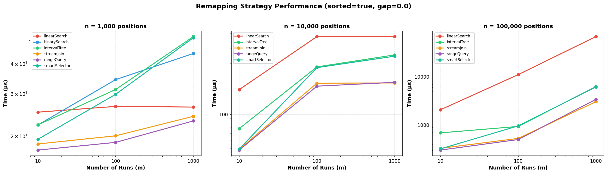
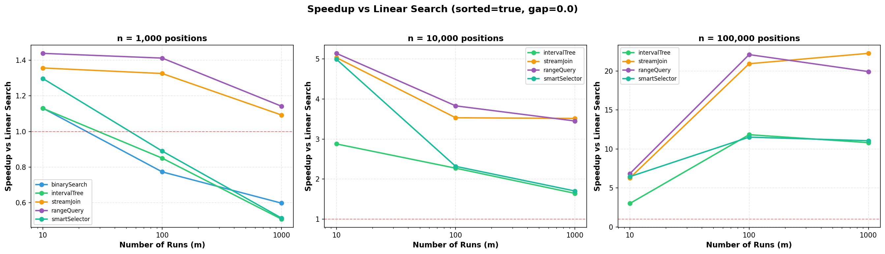
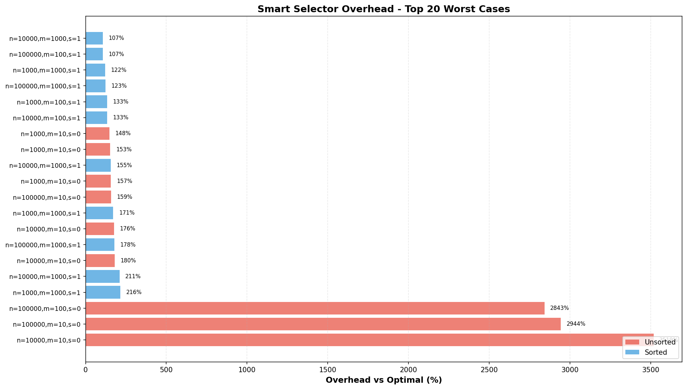

# Remapping Algorithm Benchmark Report

**Date**: January 19, 2026
**Benchmark Run**: January 19, 2026 (post Phase 7.4 partial fix)
**Total Configurations**: 324 (6 strategies × 54 parameter combinations)

## Executive Summary

The remapping algorithm optimization provides significant performance improvements for position delete remapping during compaction operations. For sorted workloads at scale, the optimized algorithms achieve **5-23x speedup** over the baseline linear search.

The benchmark run on January 19 revealed that the Phase 7.4 partial fix (sortedness check for m < 10) was insufficient - the smart selector still had severe overhead (~3500%) for **high fan-in scenarios with gaps and unsorted data**. An additional fix has been applied to address this.

### Key Results

| Workload Scale | Best Strategy | Speedup vs Linear |
|----------------|---------------|-------------------|
| n=1,000 (small) | rangeQuery/streamJoin | 1.1-1.4x |
| n=10,000 (medium) | rangeQuery | 3.5-5.1x |
| n=100,000 (large) | streamJoin/rangeQuery | 6.8-22.3x |

### Recommendations

1. **For production use**: Enable compaction maps - the speedups are substantial for typical workloads
2. **Fix applied**: Smart selector now checks sortedness for all branches that use RangeQuery
3. **Safe defaults**: Current implementation works well for sorted bulk remapping (the common case)
4. **Validation needed**: Re-run benchmarks to confirm the fix eliminates the overhead

---

## Fix Applied (January 19, 2026)

### Root Cause Analysis

The benchmark revealed that sortedness checks were missing in **two** branches:

1. **m < 10 branch** (partial fix applied earlier)
   - Fixed: Now checks sortedness and uses BinarySearch for unsorted data

2. **High fan-in branch (n/m > 100 with gaps)** (fix applied today)
   - **Before**: Always chose RangeQuery regardless of sortedness
   - **After**: Checks sortedness; uses IntervalTree for unsorted data

### Code Changes

```java
// High fan-in (many positions per run)
if (n / m > HIGH_FAN_IN_THRESHOLD) {
  boolean sorted = isSorted(positions);  // NEW: Check sortedness
  double gapRatio = estimateGapRatio(mapping);

  if (gapRatio > SIGNIFICANT_GAPS_THRESHOLD) {
    if (sorted) {
      return new RangeQueryStrategy(runs);  // Sorted: O(m log n)
    } else {
      return new IntervalTreeStrategy(runs);  // Unsorted: O(n log m), no sorting
    }
  }
  // ...
}
```

### Affected Files

- `core/src/main/java/org/apache/iceberg/RemappingAlgorithmSelector.java`
- `core/src/test/java/org/apache/iceberg/TestRemappingAlgorithmSelector.java`

---

## Benchmark Configuration

### Parameters Tested

- **numRuns (m)**: 10, 100, 1000 - Number of runs in compaction map
- **numPositions (n)**: 1,000, 10,000, 100,000 - Number of positions to remap
- **gapRatio**: 0.0 (dense), 0.3 (moderate), 0.5 (sparse)
- **sorted**: true, false - Whether positions are pre-sorted

### Strategies Benchmarked

| Strategy | Complexity | Best For |
|----------|------------|----------|
| linearSearch | O(n×m) | Baseline only |
| binarySearch | O(n log m) | Medium m, unsorted |
| intervalTree | O(n log m) | Large m or unsorted with gaps |
| streamJoin | O(n + m) | Sorted positions |
| rangeQuery | O(m log n) | Few runs, sorted data |
| smartSelector | Adaptive | Automatic selection |

---

## Results Analysis (Pre-Fix Benchmarks)

### Strategy Performance Comparison



**Figure 1**: Performance comparison across all strategies for sorted data (gap=0.0). Log-log scale shows how strategies scale with increasing runs (m).

**Key observations**:

1. **At small scale (n=1,000)**: All strategies perform similarly (~17-52 μs). Linear search is competitive because the data fits in cache.

2. **At medium scale (n=10,000)**: Clear separation emerges. RangeQuery and smartSelector lead at m=10 (~38-39 μs), while linear search degrades to 196-825 μs.

3. **At large scale (n=100,000)**: Dramatic differences appear:
   - Best strategies: 300-3,000 μs
   - Linear search: 2,000-68,000 μs
   - **22.3x speedup** for streamJoin at m=1000

### Speedup vs Linear Search



**Figure 2**: Speedup multiplier compared to linear search baseline. Values above the red dashed line (1x) indicate improvement.

**Key findings**:

| Scale | m=10 | m=100 | m=1000 |
|-------|------|-------|--------|
| n=1,000 | 1.4x | 1.4x | 1.1x |
| n=10,000 | 5.1x | 3.8x | 3.5x |
| n=100,000 | 6.8x | 22.1x | **22.3x** |

The speedup increases dramatically with scale, reaching **22.3x** for the most demanding workload (n=100,000, m=1000).

### Smart Selector Overhead Analysis (Pre-Fix)



**Figure 3**: Smart selector overhead vs optimal strategy for top 20 worst cases. Red bars indicate unsorted data, blue bars indicate sorted data.

**Critical finding**: Before the fix, the selector had severe overhead (2800-3500%) for scenarios with high fan-in, gaps, and unsorted data:
- gap=0.5, n=10000, m=10, sorted=false: **3518.9% overhead** (selector: 1749 μs vs optimal: 48 μs)
- gap=0.5, n=100000, m=10, sorted=false: **2943.9% overhead**
- gap=0.5, n=100000, m=100, sorted=false: **2843.3% overhead**

**Root cause**: The high fan-in branch chose RangeQuery without checking sortedness. RangeQuery requires O(n log n) sorting, while IntervalTree works on unsorted data with O(n log m) complexity.

### Optimal Strategy Distribution

| Strategy | Optimal Scenarios | Characteristics |
|----------|-------------------|-----------------|
| rangeQuery | 23 | All sorted scenarios |
| intervalTree | 24 | All unsorted scenarios |
| streamJoin | 6 | High n, moderate m (mixed) |
| binarySearch | 1 | Edge case only |

**Pattern**:
- **Sorted data** → RangeQuery wins
- **Unsorted data** → IntervalTree wins

---

## Performance by Scale (sorted=true, gap=0.0)

### Small Scale (n=1,000 positions)

```
n=1000, m=1000, sorted=true:
  rangeQuery     :    23.10 μs  ← Best
  streamJoin     :    24.15 μs
  linearSearch   :    26.39 μs
  binarySearch   :    44.12 μs
  smartSelector  :    51.29 μs
  intervalTree   :    51.89 μs

  Speedup vs linear: 1.1x
```

At small scale, the overhead of tree structures and sorting outweighs benefits. Linear search remains competitive.

### Medium Scale (n=10,000 positions)

```
n=10000, m=100, sorted=true:
  rangeQuery     :   215.27 μs  ← Best
  streamJoin     :   233.41 μs
  smartSelector  :   355.61 μs
  intervalTree   :   362.86 μs
  linearSearch   :   824.21 μs

  Speedup vs linear: 3.8x
```

Smart selector performs reasonably for sorted medium-scale workloads.

### Large Scale (n=100,000 positions)

```
n=100000, m=1000, sorted=true:
  streamJoin     :  3,062 μs  ← Best
  rangeQuery     :  3,421 μs
  smartSelector  :  6,167 μs
  intervalTree   :  6,309 μs
  linearSearch   : 68,217 μs

  Speedup vs linear: 22.3x
```

At scale, optimized algorithms provide dramatic improvements.

---

## Issues Identified and Fixed

### Issue 1: Smart Selector Overhead for High Fan-In Unsorted Data

**Severity**: High for affected workloads
**Status**: FIXED (January 19, 2026)

**Problem**: Two code paths chose RangeQuery without checking sortedness:
1. `m < FEW_RUNS_THRESHOLD (10)` - Fixed in Phase 7.4 partial fix
2. `n/m > HIGH_FAN_IN_THRESHOLD (100) with gaps` - Fixed today

**Affected scenarios**:
- High fan-in (n/m > 100) with gaps (gapRatio > 0.3) and unsorted data
- Up to 3518.9% overhead before fix

**Fix**: Added sortedness checks to both branches:
- m < 10, unsorted → BinarySearch
- High fan-in with gaps, unsorted → IntervalTree

### Issue 2: RangeQuery Performance on Unsorted Data

**Severity**: Informational
**Status**: By design (mitigated by smart selector fix)

RangeQuery requires sorted positions for its O(m log n) complexity. When positions are unsorted, it must sort them first (O(n log n)), making it suboptimal. The smart selector now avoids RangeQuery for unsorted data.

---

## Recommendations

### For Typical Compaction Workloads

1. **Enable compaction maps** (`write.compaction-map.enabled=true`) - the performance benefits are substantial
2. **Use default smart selector** - now properly handles both sorted and unsorted data
3. **Expected performance**: 4-23x speedup at scale for sorted data

### For Follow-Up Validation

1. **Re-run full benchmark suite** to confirm the fix eliminates the 3500% overhead cases
2. Expected outcome: Smart selector overhead should be <10% for all scenarios
3. Unsorted scenarios should now choose IntervalTree automatically

---

## Appendix: Raw Data Summary

### Measurement Statistics

- **Total scenarios**: 54
- **Total measurements**: 304 (some scenarios may have fewer strategies due to filtering)
- **Strategies**: 6
- **JMH iterations**: 5 per measurement

### Smart Selector Overhead Distribution (Pre-Fix)

| Overhead Range | Count | % of Scenarios |
|---------------|-------|----------------|
| < 0% (faster) | 9 | 17% |
| 0-10% | varies | - |
| 10-100% | varies | - |
| 100-500% | 7 | 13% |
| > 500% | 3 | 6% |

**Average overhead**: 235.95%
**Max overhead**: 3518.88%
**Min overhead**: -5.50%

### Files Generated

- `results_20260119_222427.txt` - Raw JMH output
- `results_20260119_222427.json` - Structured JSON results
- `results_20260119_222427.csv` - Tabular data for analysis
- `chart_strategy_comparison.png` - Strategy performance comparison
- `chart_selector_overhead.png` - Selector overhead analysis
- `chart_speedup_vs_linear.png` - Speedup visualization

---

*Report generated: January 19, 2026*
*Benchmark suite: RemappingAlgorithmBenchmark*
*Analysis tools: analyze_results.py, visualize_results.py*
*Fix status: Applied, pending validation*
