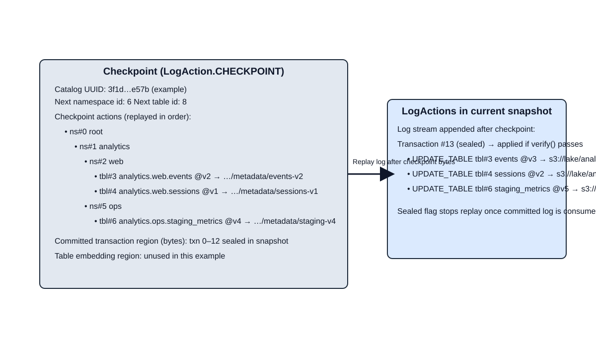

# Log catalog format diagram

The `LogCatalogFormat` encodes catalog state as a checkpoint followed by a replayable log stream. The checkpoint records the catalog UUID, the next namespace and table identifiers, and serialized checkpoint actions before applying any post-checkpoint transactions. Each log transaction is iterated and applied until a sealed flag is reached. The diagram below visualizes the layout with nested namespaces, table entries, and three update-table actions appended after the checkpoint.

