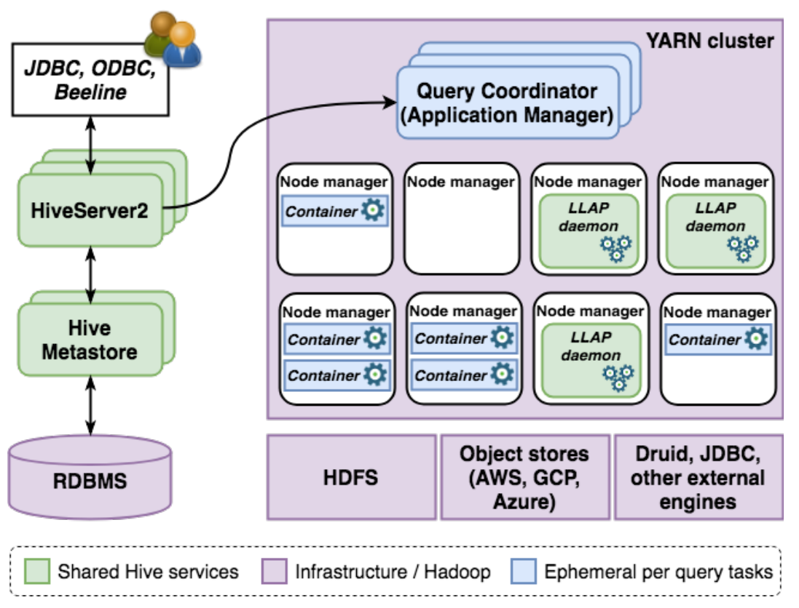
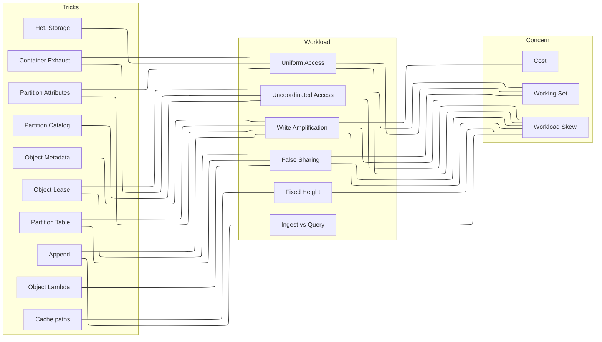

# Motivation

Today, LSTs rely on the common denominator for all the storage systems they need to support. This constrains the design to a narrow API to `PUT`/`GET` objects and- to avoid full scans- `seek()` within input streams. An atomic operation to install a new state of a single table is not assumed, but must be available for a `Catalog` implementation specified outside the storage system.

These assumptions are too pessimistic. Object stores are more capable than this minimum standard, supporting preconditions on writes, leases, independent metadata updates, and appends. The paper identifies a set of "tricks" that could be used to improve the performance of LSTs, and maps these to the workloads that could benefit from them.

## LSTs

A LST loosely fits some classic definitions of a database (Gray, 1975):

> We assume the data base consists of a **collection of records** and **constraints defined on these records**. There are physical constraints (ex: in a list of records, if a record A points to record B then record B ust exist) as well as logical constraints (ex: conservation of money in a bank checking account application). _When all such constraints are satisfied the data base is said to be consistent._
>
> A transaction is a series of accesses (for read or write operations) to the data base which, applied to a consistent data base, will produce a consistent data base. During the execution of a transaction, the **data base may be temporarily inconsistent**. The programs used to perform the transactions assume that they "see" a consistent data base.

<!-- So if several transactions are run concurrently, a locking mechanism must be used to insure that one transaction does not see temporarily inconsistent data caused by another transaction. Also, even if there are no consistency constraints, locks must be used so that the updates of one transaction are not made available to others before the transaction completes. Otherwise, transaction backup might cascade to other transactions which read or updated the "backed up" updates. -->

While this has led some to describe LSTs as "the bottom half of a database", this can be too facile. Notably, no LST format supports constraints, even primary key constraints, even when the underlying data can only be updated through a dedicated service. LST transactions never create temporary inconsistency in the table, since each commit literally (not logically) replaces the existing table state with a new checkpoint. This is mildly unfair, as LSTs also ensure data conform to an evolvable schema, provide a common type system for data interchange, include metadata for efficient query planning, and other data management features, but the consistency guarantees they offer are weaker than the database metaphor suggests.

  

More precisely, an LST is a set of protocols and formats to read an update a collection of records atomically. It effects this using the aforementioned pointer swap in the `Catalog`, which does not even require that the updates are visible in the underlying store, but that they will eventually exist.

However, these limitations are key to the success of LSTs. Large datasets are not only trivial to replicate, they can be queried _and updated by multiple engines_, concurrently. Integreation does not require reasoning about interactions among engines, or even specifying which engines are in use. **An LST allows engines to share data without requiring that they share state**. Consequently, the features LSTs support- a common type system, schema evolution, conventions for statistics- are the subset of database features that facilitate interoperability.

LSTs occupy a dual role, both as the unit of atomicity for data lakes and also as an export format for OLAP data warehouses. A traditional DW not only avoids oprational challenges LSTs introduce[^2], it vastly improves performance by coordinating updates for running queries in services. To close the gap, recent proposals pull more functionality from LST libraries into a more capable `Catalog` service, characterizing this as the evolution of LSTs- which provide scalable, atomic operations on storage- toward full-fledged data warehouses.

  

This recreates the ecosystem from which LSTs emerged. Specifically, Apache Hive was the ur-framework for SQL on unstructed data in the Apache Hadoop ecosystem. Integration with Hive components and its vestigial legacy semantics was onerous and impractical not only for alternative SQL engines, but also for simple applications, utilities, and fundamental operations chores like backup and restore. LST formats decoupled these from the Hive stack, which also removed the layers of indirection necessary for access control (`HiveServer2` compiles queries and issues keys to decrypt columns), coordination (`Hive Metastore` tracks running queries and coordinates compaction), and cached execution (`LLAP` caches table data and provides consistent query results). It is not obvious that "this time will be different", and the integration challenges and vendor lock-in will not also reappear.

Is it necessary to lift LSTs from storage to support the next generation of data lake workloads? Coordination through storage will always be slower, but not all LST coordination is necessary or uniform. The narrow storage API has helped LSTs become ubiquitous, but the underlying formats can remain compatible even if the protocols updating them are customized to the storage substrate. Many scalability bottlenecks can be resolved not by rebuilding the previous generation of data lakes, but by embracing interoperability and the separation of concerns that motivated LSTs.

# Paper Outline

In the following flowchart, a set of "tricks" is mapped to the workloads that might benefit from them, and these workload attributes are mapped to underlying causes/concerns. For example, using heterogeneous storage could improve performance/cost for workloads with non-uniform query workloads (workload skew) and a predictable working set.

The paper could work these "middle-out". Identify places where LST design assumes some attribute of the workload, which creates a concern (right) but also several solutions (left). We then evaluate the improvement each of these tricks could effect on a synthetic microbenchmark.
<!-- %%{init: {"flowchart": {"defaultRenderer": "elk"}} }%% -->
<!-- %%{init: {"flowchart": {"curve": "bundle" }} }%% -->

## Trick -> Concern

| Trick | Concern |
|-------|---------|
| _Heterogeneous Storage_ | LSTs ingest data in the same storage as archival data. Opportunities to store data in different tiers could improve performance for frequently accessed data and lower costs for infrequently accessed data. |
| _Append_                | The catalog, metadata, and data files are rewritten during compactions and normal operation. Often(?) updates are much smaller than what they invalidate. [Detail](#append) |
| _Cache paths_           | Traversal of object graphs incurs a RTT penalty for each node in a path. Either a small service that caches paths- LRC, LRU, etc.-, writing downstream paths in the object metadata, or serializing the traversal of immutable data could save the O(h) RTT penalty on access. [Detail](#cache-paths)|
| _Partition Catalog_      | If transactions rarely (or never) span some tables, then a `Catalog` could be multiple objects updated independently. Cross-catalog transactions could be coordinated using leases and/or continuations. |
| _Partition Table_       | The `Catalog` maintains only one pointer for the head of each table. If the `Catalog` supports atomic replacement of multiple pointers- i.e., multi-table transactions- then one could also reduce false sharing within a table by maintaining multiple head pointers to partitions of the table. This could also reduce subsequent write amplification caused by rewriting merged metadata. |
| _Partition Attributes_  | Often(?) only some attributes are updated within a row, but the entire file needs to be rewritten. Writing frequently-updated attributes into a separate file- or in combination with `append`, appending a new stripe with metadata- could reduce write amplification during updates. |
| _Object Lease_          | Objects can be locked. Instead of using a service, one could use this mechanism from the object store for locks. Leases could also make `append` safer to use, by preventing interleaved appends to the object. |
| _Object Lambda_         | By intercepting `GET` requests, one could represent the state of an object as the merge of its state in S3 and a deterministic merge of a FIFO queue of pending commits. Writers would merge their update and commit by proxy. [Detail](#object-lambda) |
| _Object Metadata_       | Some stores allow one to update (and version) object metadata (k/v pairs) and object data separately. One could signal potential conflicts between running transactions, including compactions. |
| _Container Exhaust_     | Object stores produce CDC streams for containers. Either by listening to exhaust across the entire container- or partitioning data/metadata to receive a subset- running transactions could learn about concurrent modifications before commit validation. |

## Workload -> Concern

| Workload | Concern |
|---------|----------|
| Uniform Access      | Storing all data in the same tier misses opportunities to save on cost for infrequently accessed data, distinguish between data landing in the LST vs historical data, and does not adapt to query patterns. |
| Fixed Height        | LST formats are the same height, regardless of the size of the table [^3]. As tables get larger, conflicts need to rewrite larger metadata objects even for false conflicts. Increasing the height of the table includes more round trips to the store. |
| Write Amplification | Object immutability requires that updates be written separately and merged with base data either as part of the transaction or as a background activity. Rewriting data and metadata incurs avoidable overheads and costs. |
| False Sharing       | Storing lists in immutable data structures requires re-merging on conflicts. Often(?) these conflicts are spurious. |
| Ingest vs Query     | New data can be blindly written into tables, as ingest often need not block running queries. Treating this uniformly challenges LST design. |

<!-- challenges design? wtf are you even saying? -->

## Trick details

### Append

Object immutability vastly simplifies replication, but it also requires that any updated data be rewritten elsewhere. This has a modest overhead for writing delta files- small objects that supplement the base data- but incurs a read penalty as objects must be merged on read. The `append` operation offers opportunities at every logical level to reduce write amplification and (potentially) increase concurrency.

#### Data files

Data files like ORC and Parquet include a footer that contains metadata and pointers back into the object, identifying the offets of active regions. These regions do not need to be contiguous, so one could write a new Parquet row group ("stripe" in ORC) that replaces only the row group and writes a new footer, retaining all the existing data. If existing snapshots include the length (i.e., the offset for the old footer), then one can replace only the updated row groups. Since ORC and Parquet are column-oriented, it may be possible to update only the attributes that were updated[^1] and use offsets into the original stripe.

Concurrent `append` operations could leave uncollectable garbage interleaved with active data if the transaction fails. This could be mitigated by using object leases to lock the object, so concurrent updates are written to delta files. Since no metadata contains the appended data, is is not visible in LST snapshots and will be eliminated during compactions.

#### Manifests

Manifest lists and Manifest Files both contain pointers to other objects. Since these cannot be updated in place, conflicts to unrelated partitions of the table require a merge operation. This could be avoided using a similar technique to data files, but since manifests often(?) only update a fraction of their referants, appending the changes and inferring the order (or exclusion) from the parent could reduce write amplification.

#### Catalog

Pointer swaps in the `Catalog` create high conflict rates. However, blind appends provide an order for committing transactions as a crude log. Under high contention, readers could reach a deterministic decision about the state of every table in the `Catalog`; each append includes a precondition for the swap, which can be interleaved. Combined with the compare-and-swap operation and/or object leases, periodic compaction could provent the `Catalog` object from becoming too large.

### Cache Paths

Two paths are traversed by LST queries. The first is the path from the `Catalog` to data files. The second is the deterministic merge of files on read.

#### Catalog Path

As in FileSystems resolving inodes, LST paths are crabbed by readers resolving data. Caches could reduce the RTT penalty by caching full paths in the working set from the root. Validation of the path could be asynchronous if the hints are written into metadata, or even deferred to query validation (when changes to metadata must be examined, anyway).

#### Merge Path

To avoid write amplification from CoW objects, deletes and inserts are often written as separate files and associated with the base in a manifest. Merging these files on read follows the same sequence for every reader in a range, including skipping records. Similar to NoDB, readers could leave artifacts that describe the merge and help subsequent readers avoid the same work. To avoid updating manifests, these supplementary data could be referenced in object metadata (GCP) or appended (Azure).

### Object Lambda

Unconventionally (and kind of cheating), one could intercept `GET` requests to the `Catalog` and merge events from a FIFO queue to deterministically generate its state. In effect, readers would merge their state with "committed" updates by proxy. Successful writers would promote their own updates with other, non-conflicting table updates.

This could be extended to files beyond the `Catalog`, particularly metadata files.

# Appendix

## Storage ideas

The paper identifies opportunities to use existing object store features for LSTs. What other features could be useful?

* TTL for moving data between tiers (surely this already exists? At least a LFU migration policy)
* Multi-part uploads can preserve boundaries (e.g., of row groups). Reference-counted segments could reduce duplication and write amplification.

# Footnotes

[^1]: Space could be saved by making all offsets relative to the row group and/or limiting the range. If these formats made those optimizations, then it would be more difficult (or impossible) to avoid rewriting the row group. Right now, the independence of column dictionaries can produces files that are too large, but for our purposes that could be an asset (avoiding a dependency between the old and replacement row group). Parquet and ORC are now considered last-gen, so we hope to motivate future formats to admit this optimization.

[^2]: The paper will be more explicit about the operational challenges LSTs introduce. For example, the client-driven update model is a source of bugs in commit logic, which are painful to extinguish in the wild. No required integration of new engines means one doesn't know what's updating the table.

[^3]: Iceberg certainly. Delta/Hudi?