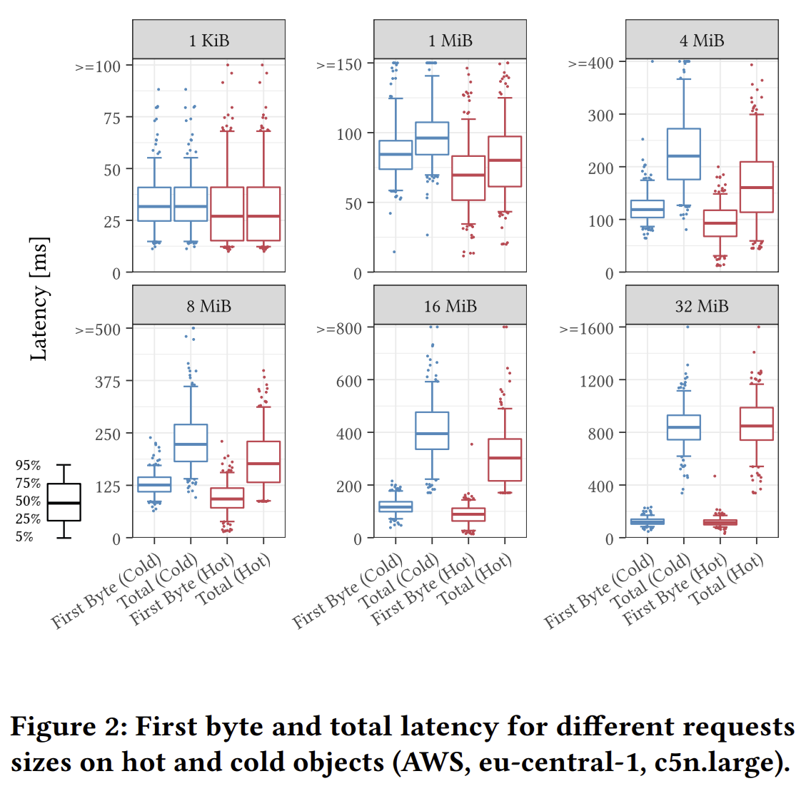

# VLDB

tl;dr
- 3-6 months to complete all tasks
- lower bound includes all implementation but not experiments

## Schedule

Week 1: CAS Catalog (S3) ✅ \
Week 2: Embed Table Metadata \
Week 3: ibid \
Week 4: Catalog Append (Azure) \
Week 5: Blind appends (Azure) \
Week 6: Lease+Position appends (Azure, AWS) \
Week 7: Lambda Append (S3)

<!--
## Aggressive Schedule

Week 1: CAS Catalog (S3) ✅ \
Week 2: Embed Table Metadata \
Week 3: ibid \
Week 4: Split table entries \
Week 5: ibid \
Week 6: Parquet/ORC Append (Azure) \
Week 7: Blind appends (Azure) \
Week 8: Lease+Position appends (Azure) \
Week 9: Catalog Append (Azure) \
Week 10: Metadata Append (Azure) \
Week 11: Lambda Append (S3) \
Week 12: Experiments
-->

## Model

To motivate the following, we assume average read latencies for "hot" objects from [Leis et al.](https://dl.acm.org/doi/abs/10.14778/3611479.3611486). These will differ for Azure and GCP. Assume appends in Azure have the same cost per byte.

  

#### Eyeball statistics from Figure 2
| Object size | Fig2 Avg Latency (ms) |
|-------------|-----------------------|
| 1KiB        | 25                    |
| 1MiB        | 80                    |
| 4MiB        | 150                   |
| 8MiB        | 170                   |
| 16MiB       | 300                   |
| 32MiB       | 850                   |

<!-- 

#### ChatGPT riffing

Doesn't match. Forget it.

 GPT Avg Read Latency | GPT Avg Write Latency |
----------------------|-----------------------| 
 7 ms                 | 8 ms                  |
 25 ms                | 30 ms                 |
 60 ms                | 70 ms                 |
 125 ms               | 150 ms                |
 225 ms               | 260 ms                |
 450 ms               | 500 ms                |

| Object Size | Average Read Latency | Average Write Latency |
|-------------|-----------------------|-----------------------|
| 1 KB        | 7 ms                 | 8 ms                 |
| 1 MB        | 25 ms                | 30 ms                |
| 4 MB        | 60 ms                | 70 ms                |
| 8 MB        | 125 ms               | 150 ms               |
| 16 MB       | 225 ms               | 260 ms               |
| 32 MB       | 450 ms               | 500 ms               |

| Object Size | Read Latency        | Write Latency       |
|-------------|---------------------|---------------------|
| 1 KB        | 5 - 10 ms | 5 - 12 ms |
| 1 MB        | 20 - 30 ms| 22 - 35 ms|
| 4 MB        | 50 - 70 ms| 55 - 80 ms|
| 8 MB        | 100 - 150 ms| 110 - 170 ms|
| 16 MB       | 200 - 250 ms| 220 - 280 ms|
| 32 MB       | 400 - 500 ms| 440 - 550 ms|

-->

### Assumptions

* Each snapshot adds roughly 1KiB of metadata to JSON root metadata
* Other data in the root JSON is 10kb
* Append latency is identical to write latency
* Services are a PITA and we don't want to run them
* Disable caching? Object size latency-sensitive? Be careful to make sure we get wins

&nbsp;

----

&nbsp;

# Implementation (3-6 months)

## 0. Thoroughness
    Microbenchmarks of storage systems

* Repeat [Leis23] experiments with Azure and GCP (1-2 weeks)
* Measure append latency

TODO: star things that can be easily cached

## 1. CAS Catalog (Azure, GCP, S3)
    Atomically replace the root of the catalog without a service

Estimate: **3-5 days**

Benefit: multi-table transactions, no services \
Cost: false conflicts, low(er) throughput

Could include HDFS among these. `HadoopCatalog` is the listing-based Catalog that was recently deprecated. Mostly building on what's already on the truck.

#### Work items
    [ ] S3 (3-5 days)
        [ ] Pass Catalog tests
        [ ] Pass MTT Catalog tests

## 2. Embed Table Metadata file in Catalog (Azure, GCP, HDFS, S3)
    Generate JSON roots from CatalogFlie

Estimate: **3-10 days**

Benefit: avoid RTT to JSON catalog \
Cost: all table metadata visible to all users, no recovery without object versioning, serial table writes (to catalog) \
Risk: distributed execution may not run the table commit at the coordinator (probably ignorable)

For each conflict, cut cost of reading table metadata (~50ms per table, per attempt in RTT). Some compression savings, but these are offset by reading the full catalog.

#### Work items
    [ ] Update file format (1-2 days)
      [ ] Swap old/new UUID with old UUID/new root (for CAS)
    [ ] Trap write to metadata in Catalog (1-3 days)
      [ ] Metadata write is in a utility, refactor to accept a stream to the open CatalogFile
    [ ] Capture read of JSON root (1-5 days)
      [ ] Resolve URI to CatalogFile reference
      [ ] If complicated, hack directly (i.e., feature flag + resolve from reference)

## 3. Split table entries in Catalog (Azure, GCP, HDFS, S3)
    Partition table into multiple entries in the Catalog

Estimate: **5-15 days**

Benefit: fewer false conflicts, smaller manifest list for active partitions \
Cost: larger catalog, additional requests for partitions (if read) \
Risk: may break internal assumptions, particularly distributed (serde)

Potential savings of ~100ms per snapshot (manifest list RTT) in the conflict set. Could be requested in parallel, so more likely max({ manifest RTTs }). For tables that frequently update one partition (e.g., latest), it partitions the blind insert case from other transactions (ish).

#### Work items
    [ ] Composite table entry w/ partitioning (3-8 days)
        [ ] Return composite table from CatalogFile with all matching references
    [ ] Conflict detection (2-8 days)
        [ ] Merge-on-read
        [ ] Partitioned resolution

# Arbor of Append

## 4. Parquet/ORC Append (Azure, HDFS)
    Replace row groups by appending a new footer

Estimate: **1-3 weeks** (some amortized over subtasks)

Benefit (5*): lower write amplification, fewer false conflicts, GC simplified (no scans of container) \
Cost (5*): Internal fragmentation, aborts/failed transactions leave data that must be compacted away

This sets up tasks 5-8. The goal is to have a container/record format suitable for atomic, multi-writer append. Modifying an existing format avoids adding new dependencies/complexity and inherits existing work on compaction/correctness.

#### Work items
    [ ] Study Parquet, find relevant code (1-3 days)
        [ ] ALT: Do this in ORC (1 day)
    [ ] Insert
        [ ] Delta append, merge-on-read (5-10 days)
        [ ] Merge-on-write (5-10 days)
    [ ] Compaction (1-2 weeks)
        [ ] Tombstone for compaction (lock + swap); lock required?
        [ ] CAS with CatalogFile, any writer can force
        [ ] Preserve entries after tombstone
        [ ] Summarize tbl updates for subsequent readers (elide failed commits)
        [ ] Update readers to understand compaction sketch
        [ ] ALT: include UUID of new CatalogFile in tombstone, avoids lock but sketch still required
    [ ] Deletes
        [ ] Implied by merge-on-write
    [ ] ALT: manual format for Catalog (3-5 days)
        [ ] AppendCatalogFile uses offset with generation stamp in InputFile
        [ ] Simpler than ORC/Parquet, use zlib/lz4/snappy for 4MiB limit

### 4a. Blind Append (**Azure**)
    Atomic write to the end of a file, read to determine success

Estimate: **1-2 weeks**

Benefit: multi-writer, sequential consistency w/ read-my-writes (i.e., all writers will see a prefix, eventually the same prefix) \
Cost: 4MiB atomicity limit \
Risk: Embedded metadata may exceed 4MiB limit

Batches CAS events across commits, avoiding some of the overhead from false
sharing in the Catalog. Instead of ~3tps CAS, each pointer append is ~25ms
(1KiB) and reads may expand to the compaction threshold. Embedding metadata may
increase the size of the append up to 4MiB.

#### Work items
    [ ] Design (< 1 day)
    [ ] Modify CatalogFile::commit to write updated entries and validate (3-5 days)
        [ ] Blind append w/ etag (to avoid appending to file that's compacted out)
        [ ] Read validation, throw exception on conflict
    [ ] ALT: Bury this in the implementation of the Catalog/metadata, rather than generalizing up to the IO layer

### 4b. Position Append (Azure)
    Append-at-offset to the Catalog file

Estimate: **1-2 weeks**

Benefit: +/- CAS per request, early conflict detection, simpler compaction \
Cost: Higher conflict rate

Gains here depend on CAS vs append latency. Re-reading the object after each failed append ensures that the tombstone will be read before a subsequent append is attempted. No summary is necessary for later readers.

#### Work items
    [ ] Modify CatalogFile::commit to use append-at-offset (3-5 days)
        [ ] Append-at-offset w/ etag (avoid matching previous object)
        [ ] Read validation (should be identical to blind append)
    [ ] Avoid complexity of 4a compactions

### 4c. Lease Append (Azure, HDFS)
    Pessimstic locking for append to the Catalog file

Estimate: **3-8 days** \
Benefit: No 4MiB limit \
Cost: Precludes progress in other writers

Useful as a fallback for 4a/4b, when a writer is unable to commit. Also used for locking CatalogFile during compaction.

#### Work items
    [ ] Lease append (1-3 days)
    [ ] Handle write rejections w/ retry on other, concurrent writers (1-5 days)

## 5. Catalog Append (Azure)
    Append updates to a Catalog file

Dependency: 4a-c \
Estimate: **3-15 days** \
Benefit: No write amplification, faster than CAS \
Cost: Re-read to verify, requires periodic compactions \
Risk: `append()` had better be fast. Ignoring most modifications (schema, namespace), other than those on the commit path.

Catalog updates are appended, the version of a catalog file is not just an etag
but an etag + length. Specialization at this level could speed up development,
at the cost of generality and later complexity/duplication.

#### Work items
    [ ] Design (1-2 days)
    [ ] Integrate with 4a-c for write path (3-5 days)
        [ ] ALT: custom, hack into place. This only works on Azure, S3 may also need customization.
    [ ] Read validation (3-5 days)
    [ ] Compaction (1-2 weeks)

## 6. Metadata Append (Azure)
    Concurrent append to manifest files

**Review spec; manifest/process covers many data files?**

Dependency: 4 \
Estimate: 2-3 weeks

Benefit: Update the manifest list by appending to it \
Cost: Complexity, compaction

s/manifest list/manifest log/. 4MiB limit similar to a nested subtransaction. Commits in the root essentially truncate the log.

#### Work items
    [ ] Design (1-2 weeks)
    [ ] Include length in pointer to manifest list (2-15 days)
        [ ] Snapshot is a prefix of the manifest list, or a compaction of it
        [ ] Commit validation of a snapshot must include rewriting (re-appending) to a new manifest list if it was compacted out
    [ ] Segment commits to manifest list (i.e., begin/end markers) (3-10 days)

## 7. Data Append (Azure)
    Concurrent append to data files (replacing delta files)

Estimate: **2-6 weeks**

Benefit: lower write amplification, fewer false conflicts, fewer objects \
Cost: Adds conflicts/coordination between concurrent transactions

**Exceeds 4MiB atomic append, Lease Append (5c) only**

Realistically, this requires modifications to ORC or Parquet. The goal would be
for "fast append" (blind writes) to consist of appends (+ compaction) going "up"
the tree to the root. The protocol would lock (> 4MiB) the data file, write new
data + footer, write a manifest, then append to the manifest list and append to
the Catalog.

This makes the common case- importing new data- avoid conflicts with other
transactions since each operation can only block concurrent appenders during
write. Under contention, one can always fall back to writing to a new object and
updating the manifest list. Since fast appends all commute, this shouldn't be a
problem.

This runs into a lot of complexity and active work in Iceberg.

#### Work items
    [ ] Update 

## 8. Lambda Append (S3)
    Write to an explicit queue, object requests return a prefix, merges to S3

Dependency: S3 CAS Catalog \
Estimate: **2-4 weeks**

Benefit: Simulates append with another service (not Azure-only) \
Cost: Complexity, requires another (generic) service, bypassing object lambda yields an older checkpoint \
Risk: May not work.

This is changing client multi-writer to an aggregation tree with lambda
functions. It still requires an atomic pointer swap of the Catalog file. In
practice, it should be similar to the Azure implementation, as clients need to
know which of their writes were persisted and lambda instances need to know
which SQS entries are included in the checkpoint.

#### Work items
    [ ] Design (1-2 days)
    [ ] Writes to SQS FIFO (2-3 days)
    [ ] Lambda function (5-15 days)
        [ ] Merge on read from queue (2-3 days)
        [ ] Compaction to S3 (3-4 days)

# Courtyard of Coordination CUT

Tasks that communicate with concurrent transactions through storage. These could be useful, but can be left to future work.

## 9. Embed manifest pointers in Catalog (Azure, GCP, HDFS, S3)
    Include optional skip pointers to manifests in Catalog

Estimate: **2-4 weeks**

Benefit: avoid reading manifest list, skip/avoid manifests \
Drawback: larger catalog, **specification change**

#### Work items

## 10. Breadcrumb Append (Azure, GCP, HDFS)
    Include hints for concurrent transactions encountered during updates

Estimate **2-5 months** \
Benefit: Early conflict detection, altruistically speed up conflicting transactions \
Cost: specification change, tracking overhead, complexity

Appending at an offset beyond the length recorded in the snapshot means there's another transaction with a write conflict on this partition. Transactions can both pre-validate conflicts (assuming they commit later) and leave forwarding pointers if they commit earlier.

#### Work items
    [ ] Design (1-2 weeks)

# Experiments

# Random notes
Storage services
* Tentative write? GC objects in group without "commit" action
  * Avoids scan of objects in container, automatically cleaned up
